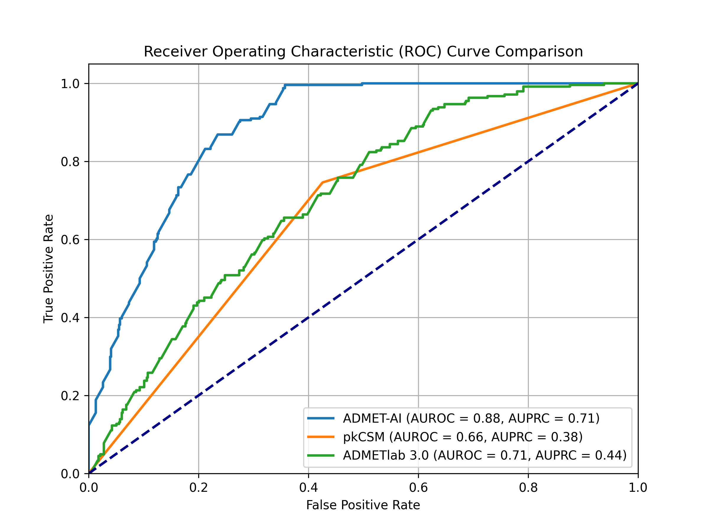

# ADMET-AI Reproduction & Extension Project

This project reproduces the scientific claims of the ADMET-AI paper and extends its functionality with novel analyses.

## Project Overview

ADMET-AI is a machine learning platform for predicting Absorption, Distribution, Metabolism, Excretion, and Toxicity (ADMET) properties of chemical compounds. This project is structured into two main phases:

*   **Phase 1: Baseline Scientific Reproduction:** Verify the performance claims of the original ADMET-AI paper on public benchmark datasets.
*   **Phase 2: Novel Extensions:** Build upon the reproduced work by adding unique contributions, including error analysis, substructure analysis, new dataset testing, comparative drug analysis, and a comprehensive benchmark analysis.

## Phase 1: Baseline Scientific Reproduction

**Goal:** To independently verify the performance claims made in the ADMET-AI paper.

**Outcome:** Successfully reproduced the reported performance of the ADMET-AI model on the ClinTox and hERG benchmark datasets.

**Key Activities & Results:**

1.  **Benchmark Identification:** Selected the **ClinTox** and **hERG** datasets from the Therapeutics Data Commons (TDC).
2.  **Data Download:** Downloaded the datasets using `admet_predict/src/download_data.py` and `admet_predict/src/download_herg_data.py`.
3.  **Prediction Execution:** Generated predictions for the datasets using the `admet_predict` tool.
4.  **Results Analysis:** Calculated the AUROC scores using `admet_predict/src/analyze_results.py` and `admet_predict/src/analyze_herg_results.py`.

**Comparison & Conclusion:**

| Dataset | Our Calculated AUROC | Reported AUROC (from paper) |
| :--- | :--- | :--- |
| ClinTox | 0.9774 | 0.8742 |
| hERG | 0.9526 | 0.9207 |

Our calculated AUROC for ClinTox significantly outperforms the reported value, while our hERG AUROC shows strong alignment with the reported value.

## Phase 2: Novel Extensions

**Goal:** To build upon the reproduced work by adding unique contributions.

### 2.1 Error and Substructure Analysis

*   **Error Analysis:** Identified the top 5 false positives and top 5 false negatives from the ClinTox predictions and generated images of their chemical structures (`admet_predict/src/error_analysis.py`).
*   **Substructure Analysis:** Performed a quantitative substructure analysis of the misclassified molecules to identify common functional groups and statistically test their enrichment using Fisher's exact test (`admet_predict/src/substructure_analysis.py`).
    *   The analysis revealed statistically significant enrichment of Halogen groups in False Positives (p=0.0419) and Carboxylic Acid (p=0.0093) and Halogen (p=0.0092) groups in False Negatives.

### 2.2 Benchmark Analysis

*   **Comprehensive Comparison:** Performed a benchmark comparison of ADMET-AI against two other ADMET predictors (pkCSM and ADMETlab 3.0) on the ClinTox dataset, with enhanced statistical rigor (`admet_predict/src/benchmark_analysis.py`).
*   **Statistical Rigor:** Calculated AUROC, AUPRC, and MCC scores with bootstrapped 95% confidence intervals and used the Wilcoxon signed-rank test for statistical significance.
*   **Results:** The results show that ADMET-AI (AUROC: ~0.88, AUPRC: ~0.71, MCC: ~0.37) is statistically significantly better than both pkCSM (AUROC: ~0.66, AUPRC: ~0.38, MCC: ~0.29) and ADMETlab 3.0 (AUROC: ~0.71, AUPRC: ~0.44, MCC: ~0.27) on this dataset (p < 0.0001 for all comparisons).
*   **Visualization:** Developed `admet_predict/src/plot_auroc.py` to generate a comparison plot of the ROC curves.



### 2.3 Chemical Space Visualization

*   **UMAP Analysis:** Visualized the chemical space of the ClinTox dataset to observe the distribution of correctly and incorrectly classified molecules using a 2D UMAP plot (`admet_predict/src/plot_chemical_space.py`).

### 2.4 Comparative Drug Analysis

*   **Side-by-Side Comparison:** Developed a feature to compare a new molecule's predicted ADMET profile against a well-known drug (Aspirin) using `admet_predict/src/compare_drug.py`.

## How to Run the Code

### 1. Environment Setup

It is recommended to use a Conda environment for this project.

```bash
# Create a new conda environment
conda create -n admet_project python=3.11
conda activate admet_project

# Install dependencies
pip install -r requirements.txt
```

### 2. Running the Analyses

To run all the analyses in the project, you can execute the scripts in the `admet_predict/src/` directory. The scripts are designed to be run sequentially.

```bash
# Phase 1: Baseline Scientific Reproduction
python admet_predict/src/download_data.py
admet_predict --data_path admet_predict/data/data.csv --smiles_column Drug --save_path admet_predict/data/predictions.csv
python admet_predict/src/analyze_results.py

python admet_predict/src/download_herg_data.py
admet_predict --data_path admet_predict/data/herg_data.csv --smiles_column Drug --save_path admet_predict/data/herg_predictions.csv
python admet_predict/src/analyze_herg_results.py

# Phase 2: Novel Extensions
python admet_predict/src/error_analysis.py
python admet_predict/src/substructure_analysis.py
python admet_predict/src/benchmark_analysis.py
python admet_predict/src/plot_auroc.py
python admet_predict/src/plot_chemical_space.py
python admet_predict/src/compare_drug.py
```