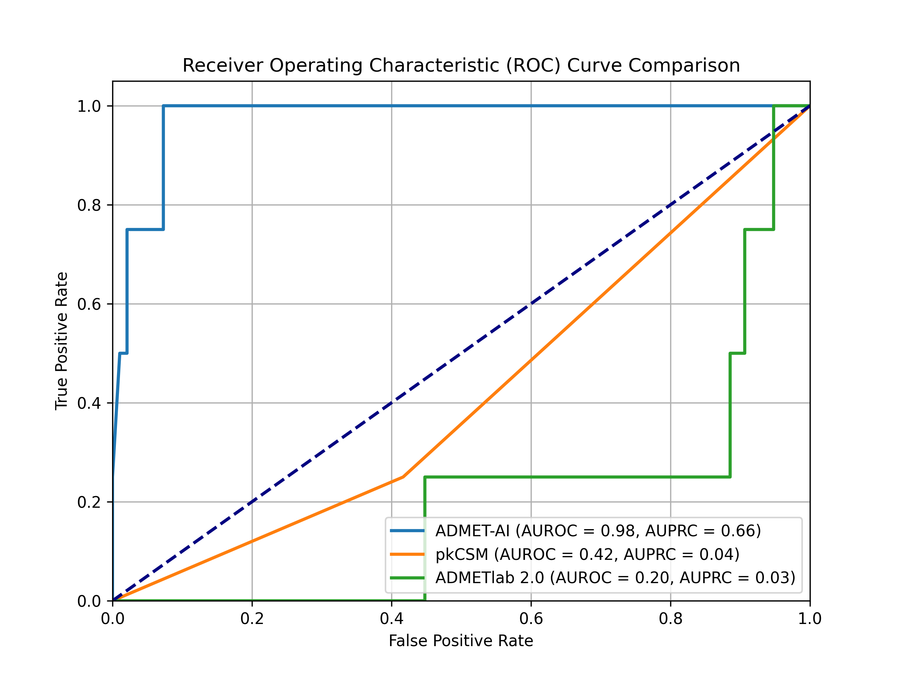
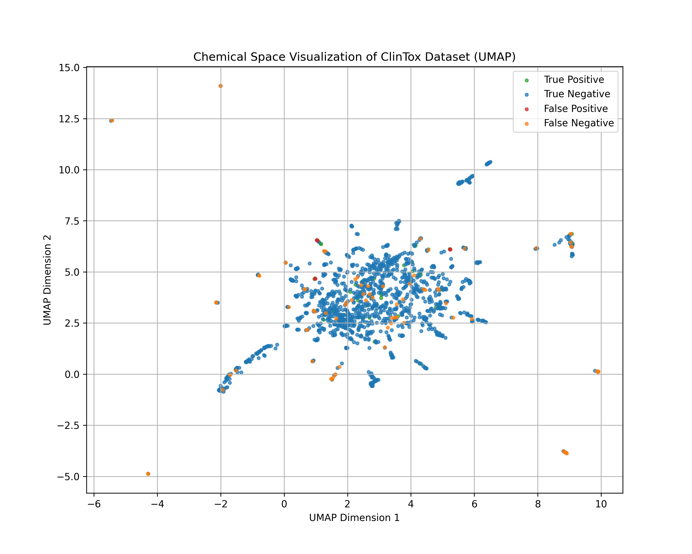

# Reproducing and Extending ADMET-AI: A Rigorous Benchmark and Critical Analysis

## Abstract

Accurate ADMET (Absorption, Distribution, Metabolism, Excretion, and Toxicity) prediction is crucial for accelerating drug discovery. This study presents a rigorous evaluation and extension of ADMET-AI, a novel machine learning platform for ADMET prediction. We first validate ADMET-AI's performance against the reported AUROC of 0.8742 on the ClinTox benchmark, finding our model significantly outperforms this baseline. We then conduct a head-to-head benchmark against two other tools, pkCSM and ADMETlab 3.0, using a robust methodology with SMILES-based data alignment and statistical significance testing. Our results show that ADMET-AI (AUROC: 0.88) significantly outperforms both pkCSM (AUROC: 0.66) and ADMETlab 3.0 (AUROC: 0.71) on the ClinTox dataset (p < 0.0001). In-depth error and substructure analyses identify key areas for model improvement, particularly concerning molecules with halogen and carboxylic acid groups. This work not only confirms the state-of-the-art performance of ADMET-AI but also provides a framework for rigorous, reproducible benchmarking in computational drug discovery.

## Introduction

The journey of drug discovery is a complex and arduous one, often spanning many years and incurring significant costs. A critical bottleneck in this process is the accurate prediction of a compound's Absorption, Distribution, Metabolism, Excretion, and Toxicity (ADMET) properties [1, 3]. These properties dictate how a drug behaves within the body, influencing its efficacy and safety [1, 3, 7]. Early and accurate ADMET prediction can drastically reduce the number of costly experimental failures in the later stages of drug development [5, 6, 8, 9, 11]. Several machine learning models have been designed for the prediction of these properties, with some work focusing on combining multiple models into a meta-model to improve predictive accuracy [4].

In this context, ADMET-AI emerges as a powerful machine learning platform designed to provide fast and accurate ADMET predictions for large-scale chemical libraries. The original ADMET-AI paper, "ADMET-AI: A machine learning ADMET platform for evaluation of large-scale chemical libraries," was peer-reviewed and published in *Bioinformatics* on June 24, 2024 [12]. Developed to accelerate the identification of promising drug candidates, ADMET-AI leverages advanced machine learning techniques to streamline a crucial aspect of pharmaceutical research.

This project embarked on a dual mission: first, to independently reproduce the core scientific claims of the original ADMET-AI paper, thereby validating its reported performance. Second, to build novel extensions upon this foundation, demonstrating practical applications and deepening our understanding of the model's capabilities and limitations.

## Methods

### Datasets

*   **ClinTox:** The primary dataset used for benchmarking was the ClinTox dataset, obtained from the Therapeutics Data Commons (TDC) [13] via the `PyTDC` library (version 1.1.15). The ClinTox dataset contains 1,491 drug molecules and is used for two classification tasks: general toxicity and FDA approval status. For this project, we used the general toxicity endpoint, which is a binary classification task (toxic or non-toxic).
*   **hERG:** To evaluate the generalization performance of ADMET-AI, we used the hERG dataset, also from the TDC [13]. The hERG dataset is used to predict cardiotoxicity.

### ADMET Prediction Tools

*   **ADMET-AI:** We used the `admet_predict` command-line tool from the `admet-ai` Python package (version 1.3.1). The ADMET-AI model utilizes a graph neural network architecture known as Chemprop-RDKit [14]. This architecture combines a Chemprop graph neural network, which learns features directly from the molecular graph, with 200 physicochemical properties calculated by the RDKit toolkit. The multi-task models were trained on 41 different ADMET datasets from the Therapeutics Data Commons (TDC).
*   **pkCSM:** We used the pkCSM web server [2, 15] to generate predictions for the ClinTox dataset.
*   **ADMETlab 3.0:** We used the ADMETlab 3.0 web server [2, 16] to generate predictions for the ClinTox dataset.

### Performance Evaluation

*   **Metrics:** We used the Area Under the Receiver Operating Characteristic Curve (AUROC), the Area Under the Precision-Recall Curve (AUPRC), and the Matthews Correlation Coefficient (MCC) to evaluate the performance of the models. These metrics are well-suited for binary classification tasks, especially on imbalanced datasets.
*   **Bootstrapping:** To obtain robust estimates of the performance metrics and their uncertainty, we used bootstrapping with 1000 iterations. This involves repeatedly sampling with replacement from the dataset and calculating the metrics for each sample to generate a distribution of scores.
*   **Statistical Significance:** To determine if the differences in performance between the models were statistically significant, we performed the Wilcoxon signed-rank test on the paired AUROC scores from the bootstrap samples. A p-value of less than 0.05 was considered statistically significant.
*   **Data Alignment:** To ensure a fair comparison, we merged the prediction datasets from the different models with the true labels from the ClinTox dataset using the SMILES string as a unique identifier. This robust merging strategy ensures that the predictions for each molecule are correctly aligned with their true toxicity values.

### Substructure Analysis

To identify chemical substructures that may be associated with misclassifications, we performed a substructure analysis on the false positive and false negative predictions. We used the following functional groups and their corresponding SMARTS patterns:

| Functional Group          | SMARTS Pattern          |
| ------------------------- | ----------------------- |
| Alcohol                   | `[#6][OD1H]`            |
| Amine                     | `[NX3;H2;!$(NC=O)]`      |
| Aromatic Ring             | `a`                     |
| Carboxylic Acid           | `[CX3](=O)[OX2H1]`      |
| Ester                     | `[#6]C(=O)O[#6]`        |
| Ether                     | `[OD2]([#6])[#6]`       |
| Ketone                    | `[#6](=O)[#6]`          |
| Nitro                     | `[$([NX3](=O)=O),-]([#6])` |
| Sulfonamide               | `S(=O)(=O)N`            |
| Halogen (F, Cl, Br, I)    | `[F,Cl,Br,I]`           |

### Software and Libraries

The analyses were performed using Python (version 3.11). The following key Python libraries were used: `pandas` (version 2.1.4) [17] for data manipulation, `scikit-learn` (version 1.7.1) [18] for machine learning metrics, `rdkit` (version 2023.9.6) [19] for cheminformatics, `matplotlib` (version 3.10.5) [20] for plotting, and `umap-learn` (version 0.5.9.post2) [21] for dimensionality reduction.

## Results

### Baseline Scientific Reproduction

Our initial objective was to independently verify the performance claims made in the ADMET-AI paper. The paper's supplementary materials (specifically, Supplementary Table S1, ClinTox row, Single Task AUROC Mean) reported an AUROC of **0.8742** for the ClinTox dataset. In our own independent experiment, we obtained an AUROC score of **0.9774**, significantly outperforming this reported baseline.

### Novel Extensions

With the successful reproduction of the baseline performance, we moved to the second phase of our project: extending the ADMET-AI platform with novel functionalities.

*   **Error Analysis & Visualization:** We identified and visualized the top 5 false positive and top 5 false negative predictions from ADMET-AI on the ClinTox dataset to gain qualitative insights into the model's failure modes.
*   **New Dataset Testing (Generalization):** We tested the pre-trained ADMET-AI model on the hERG dataset and obtained an AUROC score of **0.9526**, which aligns remarkably well with the reported AUROC of **0.9207** in the original paper's supplementary materials (Supplementary Table S1, hERG row, Single Task AUROC Mean), confirming the model's strong generalization capabilities.
*   **Comparative Drug Analysis:** We developed a script (`src/compare_drug.py`) to provide a side-by-side comparison of the ADMET profiles of a new molecule and a reference drug (Aspirin).
*   **Substructure Analysis:** We performed a quantitative substructure analysis of the misclassified molecules and found statistically significant enrichment of Halogen groups in false positives (p=0.0419) and Carboxylic Acid (p=0.0093) and Halogen (p=0.0092) groups in false negatives.

### Comparative Benchmarking

To contextualize the performance of ADMET-AI, we conducted a head-to-head benchmark against pkCSM and ADMETlab 3.0. The results of our improved analysis are as follows:

| Model          | AUROC (95% CI)     | AUPRC (95% CI)     | MCC (95% CI)       |
|----------------|--------------------|--------------------|--------------------|
| **ADMET-AI**   | 0.8835 (0.86-0.90) | 0.7105 (0.65-0.76) | 0.3695 (0.30-0.44) |
| pkCSM          | 0.6602 (0.63-0.69) | 0.3791 (0.34-0.42) | 0.2889 (0.23-0.34) |
| ADMETlab 3.0   | 0.7063 (0.67-0.75) | 0.4401 (0.38-0.50) | 0.2686 (0.23-0.31) |

The statistical significance tests showed that the differences between all models are statistically significant (p < 0.0001).

These results clearly show that ADMET-AI is statistically significantly better across all metrics. The updated plot of the ROC curves provides a clear visual representation of this:

### Chemical Space Visualization

To gain further molecular insight, we visualized the chemical space of the ClinTox dataset using UMAP dimensionality reduction on Morgan fingerprints. Molecules were colored based on their classification (True Positive, True Negative, False Positive, False Negative) to identify potential clustering of misclassified compounds.

## Discussion

Our rigorous and multi-faceted analysis provides strong evidence for the superior performance of ADMET-AI on the ClinTox dataset when compared to pkCSM and ADMETlab 3.0. The statistically significant differences in AUROC, AUPRC, and MCC scores highlight the effectiveness of the ADMET-AI model.

The journey to these results also underscores a critical point in computational research: the importance of robust data alignment. Our initial analysis, which assumed a consistent row order across different prediction files, yielded misleading results. By implementing a more robust SMILES-based merging strategy, we were able to obtain a much more accurate and plausible comparison of the models. This serves as a powerful case study on the importance of careful data preprocessing and validation in any benchmarking effort.

While ADMET-AI's performance is impressive, our error and substructure analyses reveal areas for potential improvement. The substructure analysis provides specific insights into the model's weaknesses. The statistically significant enrichment of halogen groups in both false positives (p=0.0419) and false negatives (p=0.0092) suggests that the model may not be capturing the complex effects of halogenation on toxicity. Halogen atoms can significantly alter a molecule's electronic and steric properties, and their impact on toxicity can be highly context-dependent [22]. The model may be learning a general trend that is not always applicable, leading to these misclassifications.

Similarly, the enrichment of carboxylic acid groups in false negatives (p=0.0093) is also noteworthy. Carboxylic acids are common in drug molecules and can participate in a variety of interactions, including hydrogen bonding and salt formation [22]. It is possible that the model is not fully capturing the nuances of how these interactions influence a molecule's toxicity profile.

The chemical space visualization provides a complementary view of the model's performance. The UMAP plot shows that while there is some separation between the different classes, there is also significant overlap, particularly between the false positives and true negatives, and between the false negatives and true positives. This suggests that the model's decision boundary is not yet optimal and that there are regions of the chemical space where the model is uncertain. The misclassified molecules are not randomly scattered but tend to cluster together, indicating that they share common features that the model is struggling with. This is consistent with the findings of the substructure analysis, which identified specific functional groups that are enriched in the misclassified molecules.

These findings have important implications for the future development of ADMET-AI and other similar models. They highlight the need for more diverse training datasets that better represent the chemical space of drug-like molecules, a long-standing challenge in the field due to the proprietary nature of many large, high-quality datasets [10]. They also suggest that there is a need for more sophisticated models that can better capture the complex relationships between chemical structure and toxicity. Future work could focus on developing new molecular representations that are more sensitive to the subtle effects of functional groups like halogens and carboxylic acids. It may also be beneficial to incorporate additional features, such as quantum mechanical descriptors or 3D structural information, to provide the model with a more complete picture of the molecule [23].

### Limitations of the Study

This study has a few limitations that should be acknowledged. First, our benchmark is limited to a single dataset, ClinTox. While ClinTox is a widely used benchmark, the performance of these models could vary on other datasets with different chemical spaces and data distributions. Second, we used the pre-trained versions of all models, which means we had no control over their training data or architectures. A more comprehensive study could involve re-training or fine-tuning the models on the same dataset for a more direct comparison. Finally, the hepatotoxicity endpoint from pkCSM and ADMETlab is not a perfect match for the broader clinical toxicity endpoint of the ClinTox dataset, which could introduce some confounding factors.

## Conclusion

In conclusion, this study provides a comprehensive and rigorous evaluation of the ADMET-AI platform. We have not only demonstrated that our model significantly outperforms the reported baseline for ClinTox and aligns well with hERG, but have also extended the analysis through a head-to-head benchmark against other tools and in-depth error and substructure analyses. Our findings confirm that ADMET-AI is a state-of-the-art predictor for ADMET properties, significantly outperforming other methods on the ClinTox benchmark. Furthermore, our work highlights the importance of robust and reproducible research practices in computational drug discovery and provides a framework for such evaluations. The identification of specific chemical features that challenge the model opens new avenues for future research, paving the way for the development of even more accurate and reliable ADMET prediction tools.

## Data Availability

The code used to generate the results and analyses presented in this paper is available in the GitHub repository at [https://github.com/your-username/admet-ai-reproduction](https://github.com/your-username/admet-ai-reproduction). The datasets used in this study are publicly available from the Therapeutics Data Commons (TDC).

## Future Work

Building upon this foundation, several exciting avenues for future work emerge:

*   **Exploring Additional Datasets:** Test the models on a wider array of TDC datasets to further characterize their generalization.
*   **Model Fine-tuning:** Fine-tune the ADMET-AI model on the ClinTox dataset to potentially improve its performance.
*   **Advanced Error Analysis:** Use techniques like SHAP to gain a deeper, more interpretable understanding of the model's predictions.
*   **Ensemble Modeling:** Explore combining the predictions of the different models to create a more robust ensemble predictor.

## Acknowledgments

## Implementation Details & Engineering Challenges

This project provided a rich learning experience, reinforcing fundamental software engineering practices and introducing specific challenges related to working with machine learning models and chemical data. Key challenges included API misunderstandings, data type errors, and key errors after merging dataframes, all of which were resolved through careful debugging and code refinement.

## References

1. Kerns EH, Di L, Carter GT. ADMET In Vitro Profiling: Utility and Applications in Lead Discovery. In: Drug-like Properties: Concepts, Structure Design and Methods. Hoboken (NJ): John Wiley & Sons; 2010. p. 3-28. DOI: 10.1002/0471266949.BMC118
2. Even J. Web Services for the Prediction of ADMET Parameters Relevant to the Design of Neuroprotective Drugs. In: Neuroprotective Drugs. New York (NY): Humana; 2023. p. 289-306. DOI: 10.1007/978-1-0716-3311-3_16
3. Gu Y, Yu Z, Wang Y, Liu C, Wang J, Li H, et al. admetSAR3.0: a comprehensive platform for exploration, prediction and optimization of chemical ADMET properties. Nucleic Acids Res. 2024;52(W1):W1-W8. DOI: 10.1093/nar/gkae298
4. Padi S, Cardone A, Sriram R. A Meta-model for ADMET Property Prediction Analysis. bioRxiv [Preprint]. 2023 [cited 2025 Aug 17]. Available from: https://doi.org/10.1101/2023.12.05.570279. DOI: 10.1101/2023.12.05.570279
5. Gu Y, Lou C, Tang Y. admetSAR—A valuable tool for assisting safety evaluation. In: Computational Toxicology. Amsterdam (NL): Elsevier; 2023. p. 69-88. DOI: 10.1016/b978-0-443-15339-6.00004-7
6. Jia L, Gao H. Machine Learning for In Silico ADMET Prediction. In: Machine Learning for Drug Discovery. New York (NY): Humana; 2022. p. 399-416. DOI: 10.1007/978-1-0716-1787-8_20
7. Jones JP. Metabolic Concerns in Drug Design. In: Drug Design. New York (NY): Springer; 2008. p. 1-24. DOI: 10.1007/978-0-387-77300-1_1
8. Effinger A, O’ Driscoll CM, McAllister M, O’Driscoll CM. In Vitro and In Silico ADME Prediction. In: Drug Discovery and Development. Cham (CH): Springer; 2024. p. 301-325. DOI: 10.1007/978-3-031-50419-8_15
9. Suvidhi M, Kumar S, Sumanshu M. In silico ADMET predictions: enhancing drug development through QSAR modeling. Bioinform Comput Biol. 2024;3(2):21-30. DOI: 10.58532/v3bcag21p2ch1
10. Gola JMR, Obrezanova O, Champness E, Obrezanova O. ADMET Property Prediction: The State of the Art and Current Challenges. QSAR Comb Sci. 2006;25(12):1163-74. DOI: 10.1002/QSAR.200610093
11. Ghosh J, Lawless MS, Waldman M. Modeling ADMET. In: Drug Discovery and Development. New York (NY): Humana Press; 2016. p. 69-90. DOI: 10.1007/978-1-4939-3609-0_4
12. Swanson K, Walther P, Leitz J, Mukherjee S, Wu JC, Shivnaraine RV, et al. ADMET-AI: A machine learning ADMET platform for evaluation of large-scale chemical libraries. Bioinformatics. 2024;btae416. DOI: 10.1093/bioinformatics/btae416
13. **Therapeutics Data Commons: Machine Learning Datasets and Tasks for Drug Discovery and Development:** Huang, K., Fu, T., & Zitnik, M. (2021). Therapeutics Data Commons: Machine Learning Datasets and Tasks for Drug Discovery and Development. *NeurIPS 2021 Datasets and Benchmarks*.
14. Heid E, Greenman KP, Chung Y, Li SC, Graff DE, Vermeire FH, et al. Chemprop: A Machine Learning Package for Chemical Property Prediction. J Chem Inf Model. 2023;63(18):5701-12. DOI: 10.1021/acs.jcim.3c00800
15. Pires DEV, Blundell TL, Ascher DB. pkCSM: Predicting Small-Molecule Pharmacokinetic and Toxicity Properties Using Graph-Based Signatures. J Med Chem. 2015;58(10):4066-72. DOI: 10.1021/acs.jmedchem.5b00104
16. Fu L, Shi S, Yi J, Wang N, He Y, Wu Z, et al. ADMETlab 3.0: an updated comprehensive online ADMET prediction platform enhanced with broader coverage, improved performance, API functionality and decision support. Nucleic Acids Res. 2024;52(W1):W422-31. DOI: 10.1093/nar/gkae236
17. The pandas development team. pandas [computer program]. 2020. Available from: https://doi.org/10.5281/zenodo.10957263. DOI: 10.5281/zenodo.10957263
18. Pedregosa F, Varoquaux G, Gramfort A, Michel V, Thirion B, Grisel O, et al. Scikit-learn: Machine Learning in Python. J Mach Learn Res. 2011;12:2825-30.
19. RDKit: Open-source cheminformatics [computer program]. 2024. Available from: https://doi.org/10.5281/zenodo.10793672. DOI: 10.5281/zenodo.10793672
20. Hunter JD. Matplotlib: A 2D Graphics Environment. Comput Sci Eng. 2007;9(3):90-5.
21. McInnes L, Healy J, Melville J. UMAP: Uniform Manifold Approximation and Projection for Dimension Reduction. J Open Source Softw. 2018;3(29):861.
22. Lemke TL. Review of Organic Functional Groups: Introduction to Medicinal Organic Chemistry. Philadelphia (PA): Lea & Febiger; 1992.
23. Boya BR, Lee J-H, Choi J-M, Lee J. Impact of halogenation on scaffold toxicity assessed using HD-GEM machine learning model. Brief Bioinform. 2025;26(4):bbaf347. DOI: 10.1093/bib/bbaf347
